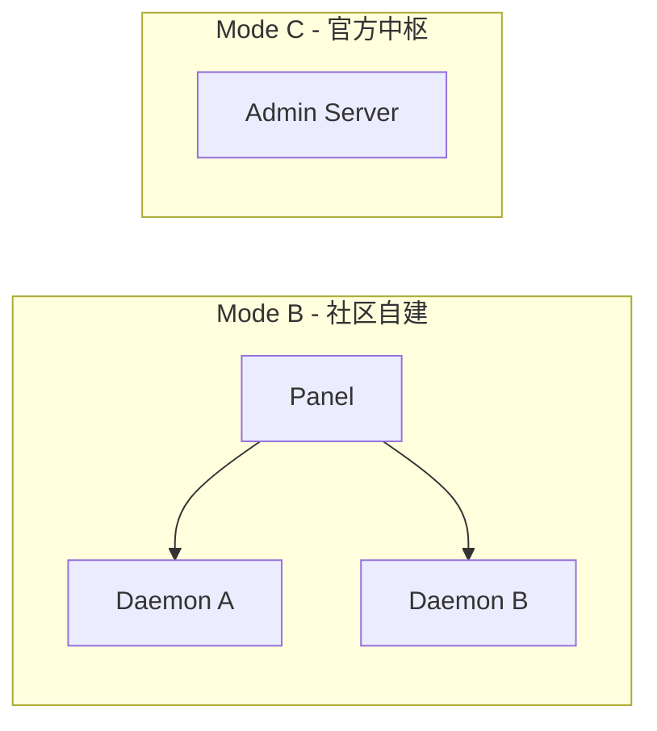

# Daemon-Panel-AdminServer

## 概述

Univona 的服务端体系由 **Daemon（社区核心）**、**Panel（管理面板）** 和 **Admin Server（官方中枢）** 三部分组成。它们是并行存在的形态：

- **Daemon + Panel** 面向社区自建场景（Mode B）
- **Admin Server** 是官方中枢，内置增强版 Panel + Daemon，并提供目录/KYC/监控等中枢能力（Mode C）

## 角色定位

### Daemon（社区核心）

- 单社区消息路由核心
- 管理频道、成员、离线消息、媒体存储
- WebSocket 实时消息与 Protobuf 协议

### Panel（管理面板）

- Web 管理 UI，可管理多个 Daemon
- 提供用户、频道、权限、监控与终端操作
- 可独立部署或嵌入 Admin Server

### Admin Server（官方中枢）

- 目录服务（社区注册/搜索）
- KYC 实名认证与合规模块
- 全局用户目录、内容监控、举报系统
- 内置增强版 Panel + Daemon

## 部署形态

## 功能差异对比

| 功能 | Daemon | Panel | Admin Server |
|------|--------|-------|--------------|
| 频道/消息路由 | ✅ | ❌ | ✅（内置） |
| 多 Daemon 管理 | ❌ | ✅ | ✅ |
| 社区目录/搜索 | ❌ | ❌ | ✅ |
| KYC 审核 | ❌ | ✅（代理） | ✅ |
| 内容监控 | ✅（社区内） | ✅ | ✅（全局） |
| 滥用举报 | ❌ | ✅（代理） | ✅ |

## 相关文档

- [整体架构](./整体架构.md)
- [三种连接模式](./三种连接模式.md)
- [认证体系](./认证体系.md)
