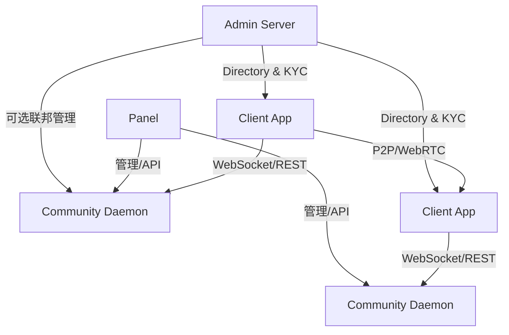

# 整体架构

## 概述

Univona 是一个混合架构的即时通讯平台，允许客户端同时连接 **官方中枢（Admin Server）**、**社区服务端（Daemon）** 与 **P2P 直连**。系统采用“目录/中枢 + 社区自治 + 端到端加密”的组合模式：

- **Admin Server** 提供全局目录、KYC、社区审核与联邦协调
- **Daemon** 负责单社区消息路由、频道管理、媒体存储
- **客户端** 执行身份生成与端到端加密，消息明文只在本地存在

## 角色与边界

| 角色 | 职责 | 可见数据 |
|------|------|----------|
| 客户端 App | 生成身份、加密/解密、聊天 UI | 全部明文内容 |
| Daemon | 频道管理、消息路由、离线队列 | 元数据与密文（依频道策略） |
| Admin Server | 目录服务、KYC、监控、联邦管理 | 社区元数据与审批信息 |
| Panel | 多 Daemon 管理 UI | 管理侧可见数据 |

## 系统拓扑

## 数据可见性

| 数据类型 | 客户端 | Daemon | Admin Server |
|----------|--------|--------|--------------|
| 消息明文 | ✅ | 仅明文策略 | ❌ |
| 消息密文 | ✅ | ✅ | ❌ |
| 成员/频道元数据 | ✅ | ✅ | 部分（目录级） |
| 身份私钥 | ✅ | ❌ | ❌ |

## 相关文档

- [三种连接模式](./三种连接模式.md)
- [Daemon-Panel-AdminServer](./Daemon-Panel-AdminServer.md)
- [通信协议](./通信协议.md)
