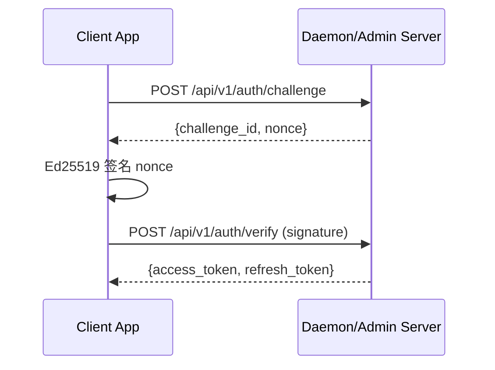

# 认证体系

## 概述

Univona 采用双层认证体系：

- **管理员认证（Admin JWT / X-Admin-Key）** 用于管理面板与中枢管理操作
- **用户认证（User JWT）** 用于客户端与 Daemon/Admin Server 的实时通信与业务 API

管理员与用户 Token 使用不同密钥签发，避免权限混淆与密钥泄露扩大化。

## 认证方式

### 1. Admin JWT

- 登录端点：`POST /api/v1/admin/login`
- Header：`Authorization: Bearer <admin_jwt>`
- 适用：管理面板与 Admin Server 管理接口
- 默认有效期：8 小时

### 2. X-Admin-Key（向后兼容）

- Header：`X-Admin-Key: <key>`
- 适用：自动化脚本或旧版工具
- 与 Admin JWT 互斥，优先级为 `Authorization` → `X-Admin-Key`

### 3. 用户 Challenge-Response

- 客户端生成 Ed25519 身份密钥对
- 服务端生成随机 nonce，客户端签名后验证
- 成功后签发 **User JWT**（access + refresh）

## Token 分离策略

| Token | 密钥来源 | 使用范围 |
|-------|----------|----------|
| Admin JWT | `JWT_SECRET` | 管理端点 | 
| User JWT | `UNIVONA_JWT_SECRET` | 用户 API/WebSocket |

## 安全要点

- Challenge 有效期短（默认 5 分钟），且一次性使用
- Refresh Token 支持轮换与过期
- 管理端与用户端 JWT **使用不同密钥**

## 相关文档

- [认证流程](../04-API参考/认证流程.md)
- [API 总览](../04-API参考/API总览.md)
- [WebSocket 协议](../04-API参考/WebSocket协议.md)
