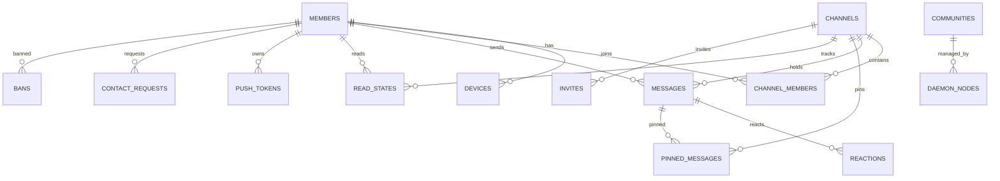

# ER 关系图

## 概述

下图展示 Univona Admin Server 的核心数据关系（子集形式），覆盖成员、频道、消息、媒体、权限与联系人等关键表。

## Mermaid ER 图

## 说明

- `members` / `devices`：用户与设备注册
- `channels` / `channel_members`：频道与成员关系
- `messages`：消息主体，关联反应、置顶与已读状态
- `contact_requests`：联系人请求（from/to 双向关系）
- `communities` / `daemon_nodes`：仅 Admin Server 才有的目录与节点管理

## 相关文档

- [Admin Server 表结构](./Admin-Server表结构.md)
- [Daemon 表结构](./Daemon表结构.md)
- [迁移历史](./迁移历史.md)
